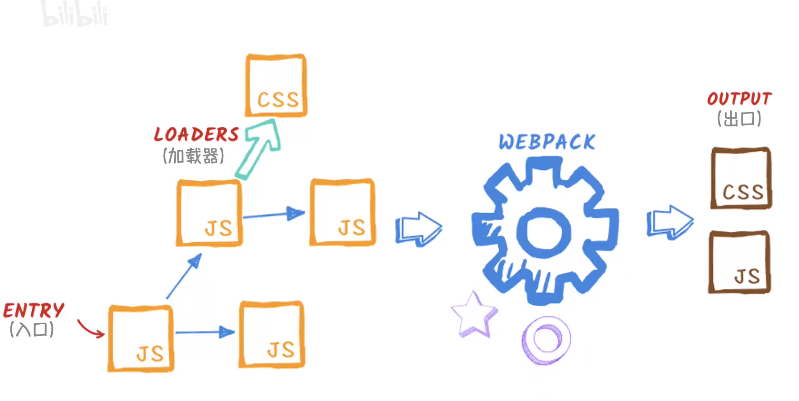

`几个问题？为什么需要webpack`
作用域问题怎么解决？ IIFE 立即调用,大数量无用代码 
代码拆分问题,node.js中的common.js ,按需加载模块的问题  commom.js能解决。但是浏览器不支持模块
如何让浏览器支持，es6module能解决但是完整  ，但是es5.6兼容问题，
所以需要webpack。 为资源处理，代码分割而生

一个问题，传统的js调用，有顺序，有依赖，顺序不对就会出现问题，项目大了，手动调整很难

```

构建一个简单的应用并让它快速运行起来？使用 Parcel。
构建一个类库只需要导入很少第三方库？使用 Rollup。
构建一个复杂的应用，需要集成很多第三方库？需要代码分拆，使用静态资源文件，
还有 CommonJS 依赖？使用 webpack。

```
 
本地安装 
cd 目录下
npm init -y
npm install webpack webpack-cli --save-dev

### 1.打包
无法将“webpack”项识别为 cmdlet、函数、脚本文件或可运行程序的名称...
现这个错误的原因是：windows10中，你的webpack是局部安装的，并没有加入到系统环境变量中，所以控制台找不到webpack命令，有以下方法可以解决：
1.在 package.json中，scripts中配置："build":"webpack"
在运行npm run build就ok啦.
2.另外也可以使用 npx webpack直接从远程拉取
webpack --stats 查看状态
### 2.打包完成，自动引入资源（插件）

"build": "webpack --watch", 表示监听js文件的变化
这个还得手动刷新，有没有自动刷新呢？
npm install --save-dev webpack-dev-server
### 3资源模块
1.asset/resource 发送单独文件并导出URL
2.asset/inline 导出资源的Data url  ，可用作 svg等 ，在打包目录看不到，需在浏览器查看
3.asset/source 资源源代码  比如 txt
4.asset  在发送 单独文件和url之间自动选择
### 4样式 loader
npm install style-loader css-loader  less-loader -D
上面加载的 样式实在 head中，有没有办法抽离呢？
### 5 css 抽离和压缩
1.需要插件npm install mini-css-extract-plugin -D
本插件会将 CSS 提取到单独的文件中，为每个包含 CSS 的 JS 文件创建一个 CSS 文件，并且支持 CSS 和 SourceMaps 的按需加载。
需要webpack5环境
2.压缩css
npm install css-minimizer-webpack-plugin --save-dev
### 6 babel-loader
npm install -D babel-loader @babel/core @babel/preset-env  3个关联库
同事需要安装 regeneratorRuntime
npm install @babel/runtime -D
npm install @babel/plugin-transform-runtime -D


### 7 代码分离（核心） 看官网

1.入口文件手动分离


